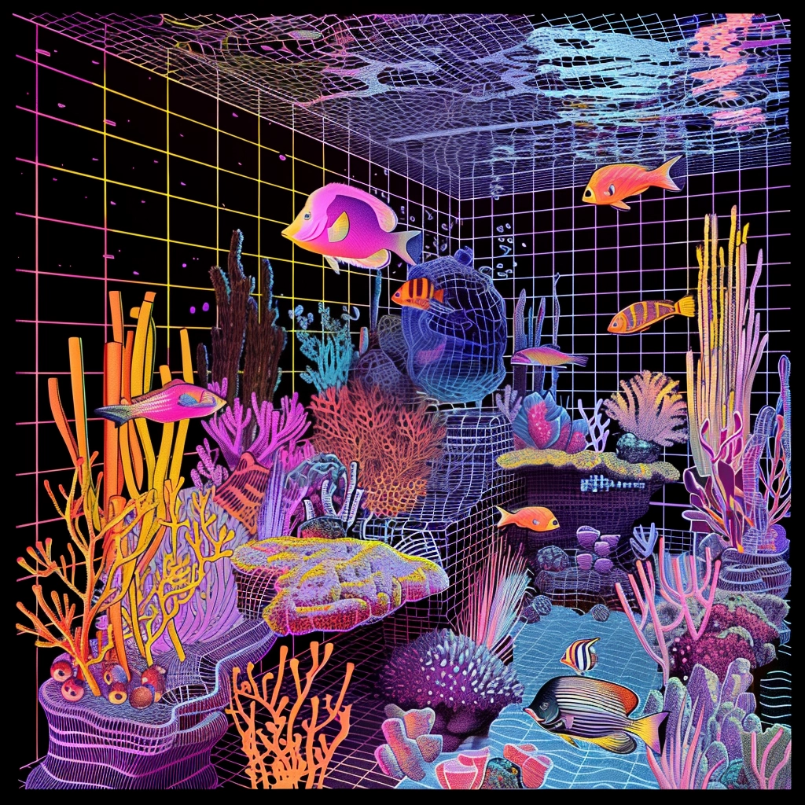

# ReefBot (BRSai)

## LLM Fine-Tuned on reefkeeping to provide the most accurate and current reef aquarium answers

   

### Goals:
   - Create chatbot that provides helpful reef hobby answers on chemistry, lighting, nutrients, flow, livestock, cycling, scaping, etc.
   - Train chatbot on the accumulated knowledge produced and/or published by BRStv over years and make it readily accessible to users, without having to search through years of video. 
### Steps:
1. ~~Use YoutTube API calls to get video IDs for key BRStv video palylists:~~
   - ~~52 Weeks of Reefing~~
   - ~~52 FAQ~~
   - ~~52 Weeks of Reefing Second Edition~~
   - ~~Interviews~~
   - ~~MACNA~~
   - ~~Biome Cycling~~
   - ~~Nutrients~~
   - Maybe: BRS Investigates (quantitative videos)
2. Get transcripts of each video
3. Fine-tune LLM on these transcripts.
4. Find high quality (by citation) scientific papers and studies on reef biology, ecology, checmistry, etc.
5. Incoroprate papers into training set.
---
* This project is not sponsored by or associated with Bulk Reef Supply. (I'm just using its content and I liked the idea of calling it BRSai)

